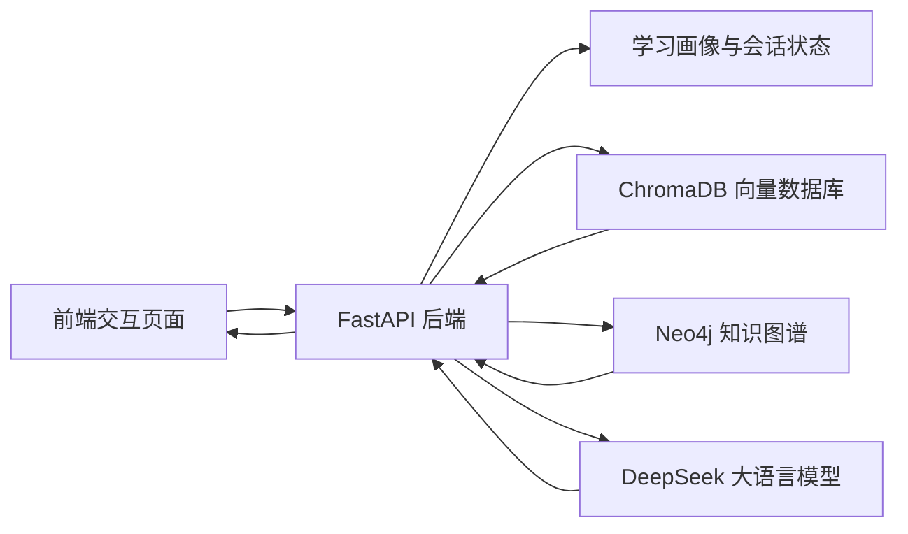

# 系统设计说明

## 系统目标

系统面向自主学习场景，目标是根据学习者的个人情况和学习材料，自动完成学习画像构建、知识点整理、诊断题生成、薄弱点记录和学习路径规划。

## 功能模块

### 1. 学习画像模块

采集用户的学习目标、年级阶段、学科、偏好和当前问题。画像信息会参与诊断题生成和路径规划。

### 2. 材料处理模块

用户上传文本材料后，系统进行切分、编号和存储。材料片段会写入 ChromaDB，供后续语义检索使用。

### 3. 知识关系模块

系统从材料和目标中提取关键概念，并生成概念之间的关系。当前实现支持内存返回和 Neo4j 写入接口。

### 4. 诊断模块

系统调用 DeepSeek，根据学习画像、材料片段和知识关系生成诊断题。题目用于判断学生基础和薄弱点。

### 5. 路径规划模块

系统根据答题结果、薄弱点和学习目标生成学习路线。路线包含补基础、新内容、练习和复习安排。

### 6. 持续练习模块

系统会围绕已记录的薄弱点继续抽题，并根据新的答题情况更新问题记录。

### 7. 学习助教模块

用户可以围绕当前学习目标提问。系统结合材料片段、薄弱点和图谱关系生成回答。

## 技术架构

## 数据流

1. 前端提交目标和材料。
2. FastAPI 接收请求并切分材料。
3. 材料片段写入 ChromaDB。
4. 系统提取概念并构建关系。
5. 诊断和问答时先检索相关片段。
6. DeepSeek 根据结构化上下文生成 JSON。
7. 前端展示诊断题、路线和练习内容。

## 当前实现状态

- FastAPI：已接入并运行。
- DeepSeek：已接入当前服务。
- ChromaDB：已真实连接并持久化到 `.chroma`。
- Neo4j：驱动和写入逻辑已实现，需配置本地 Neo4j 服务后启用。

## 设计原则

- 用户体验优先：前端不暴露复杂技术细节。
- 流程递进：每一步都为下一步提供依据。
- 可解释：分析页面展示系统如何得出判断。
- 可扩展：数据库、模型和评分逻辑都可以替换。
